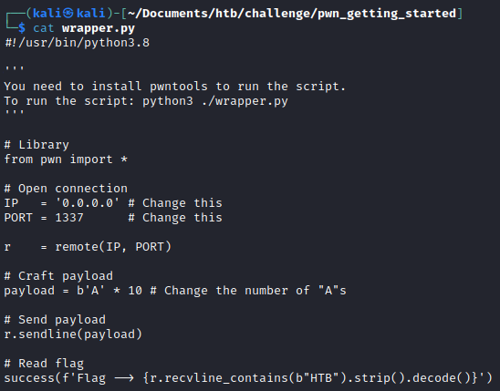
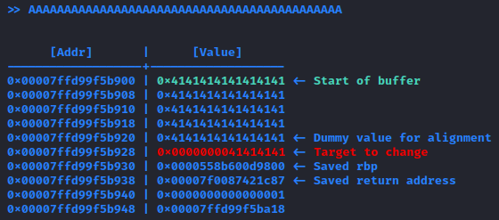
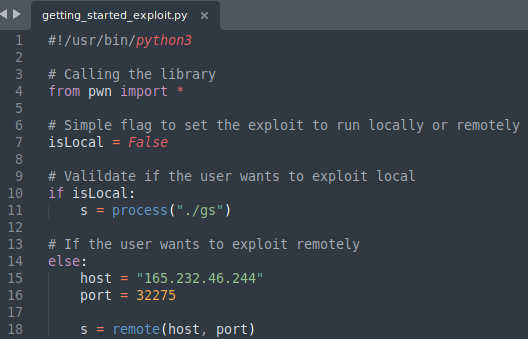

## Overview

This is a Walkthrough for Getting Started challenge on HackTheBox. Getting Started is a very easy [HackTheBox challenge](https://app.hackthebox.com/challenges/getting-started) in pwn categor that is created by [w3th4nds](https://app.hackthebox.com/users/70668). It is also a retired challenge, so we will need to use the HackTheBox Subscription to use the challenge.

## Enumeration

When unzipping the files. We were given 4 files.


Let's check the files one by one. Inside the glibc folder, there are two more files.


After searching on internet, it shows that glibc (GNU C Library) or libc (Standard C Library) is a library of standard functions that can be used by all C programs. So there is nothing to do with glibc folder.


Move into the next file, which is flag.txt. In CTF Competition, CTF stands for Capture The Flag. As the name suggests, it means that the CTF's participants are going to solve some kind of problem to receive a flag. This type of CTF is usually happen in jeopardy category. For more [information](https://cybersecurity.att.com/blogs/security-essentials/capture-the-flag-ctf-what-is-it-for-a-newbie).

Let's try to read the flag.txt file. Usually the flag.txt given to use from the downloaded file is a dummy flag. Which means that it is **not the real flag**. The dummy flag is given, so when the file is actually giving out the flag when the exploit is works on the local machine, the file is not crashed due the flag.txt is not there.


The next file is `gs` file. Since the file doesn't have any extension that indicates the file type. We can utilize `file <filename>` command to determine the file type. Turns out, the file is an ELF (Executable Linux File) in a 64-bit format. It means that the `gs` file can be run or executed.


Since we know that the `gs` file is executeable, we can execute it with the following command `./<filename>`.


It seems that the executable shows how stack and buffer overflow works. For a simple explanation. The inputted characters will be saved in stacks. Specifically on the buffer. If the buffer is full and the input is not configured properly. The characters that can be inputted may be more than the saved buffer. What happens? Well just like a glass of water. **The water will be filled up to the top, then overflow.** That’s how buffer overflow works. The impact is we can modify the variable on top of the buffer (in this case rbp or even return address) or even modify how the program works.

Last, we can check what is the last file. The last file is .py file which is an extension for python file. We can try to read the file.



It seems that the python file is to do an exploit using python. But, make sure to install pwntools library for python3 beforehand. To install pwntools library, you can use the following command `pip install pwntools` or `pip3 install pwntools` to specify that the library is for python3.

## Exploit

At the very bottom of the program, before the program ask for input. It says that we need to modify the `0xdeadbeef` value. It doesn't say that we need to modify the value to something specific. Just change it!


From the program visualization of the stack layout. We can see that if we put 4 A the stack layout will have 4 of 41. So we can calculate how many characters we need to overwrite the target or the `deadbeef`.


Every row has 8 characters that can be saved.


And there are 6 rows that needs to be filled with characters to change the value of `0xdeadbeef`.


Then 8 characters * 6 rows is 48 characters. If you just want to overwrite the "deadbeef" part and not the whole row. Simply just subtract 4 characters from the total characters since 0x00000000deadbeef has 8 zeros which translates to 4 characters.

To generate the exact characters needed, I will use python. You can use anything you like. Maybe like notepad and you type 44 characters or whatever it is.


Now let's send the characters back to the running program.


The program says that we failed. But it prints the dummy flag. Which means if we do the same on the remote machine. We will get the flag!

But before that, lets dive into how the 44 characters of A works on stack. The characters go from the `start of buffer` to the `target to change`. Since we give a good amount of characters to overwrite the `0xdeadbeef` the program will print the flag and we successfully modify the target just like what the program told us to do.



We can simply run the server on HackTheBox and get the flag! To connect to the machine, we can utilize the `nc` command.


Now all we need to do is to just send the 44 characters.


There is one last thing to try. Which to use the python script to exploit it. But, let's try to build a script from scratch.

## Building a Python Script

First of all, we need to create a filename with `.py` extension.


You can use any of the editor tools to help you to code. For this time, I will use sublime. The following script is the base exploit script that we will use.


For now, let's try to exploit locally, so we will leave the `isLocal` flag to True. Then we need to modify the payload. If we remember correctly, we need 44 characters to modify the `0xdeadbeef`. 


Let's try to run it!


IT WORKS! All that left to do is to set the `isLocal` flag to false, and modify the host and port on line 15 and 16.



Run it again and we get the flag!


Here is the final Python script to exploit.
```python
#!/usr/bin/python3

# Calling the library
from pwn import *

# Simple flag to set the exploit to run locally or remotely
isLocal = False

# Valildate if the user wants to exploit local
if isLocal:
	s = process("./gs")

# If the user wants to exploit remotely
else:
	host = "165.232.46.244"
	port = 32275

	s = remote(host, port)

# Payload that will be used to exploit
payload = b"A"*44

# Receive some information if the program/machine print something
# It can be removed if the needed
s.recv()

# Send the payload to the program/machine
s.sendline(payload)

# Read the flag with format "HTB"
flag = s.recvline_contains(b"HTB").strip().decode()

# Display the flag
success(f'{flag}')

# Close the python script gracefully
s.close()
```