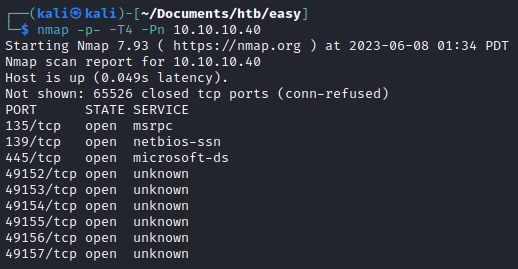
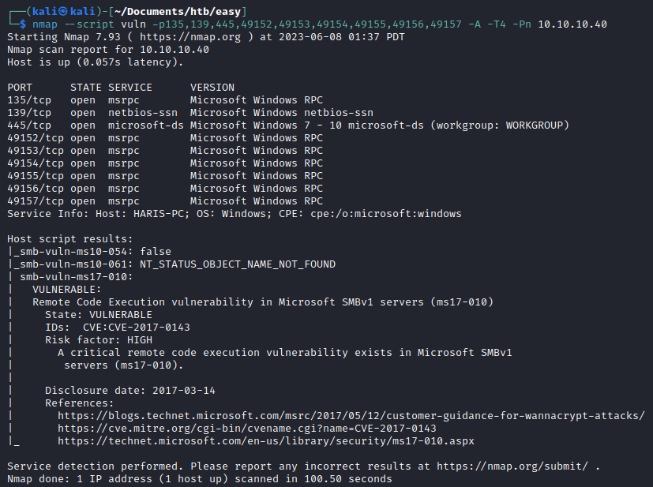
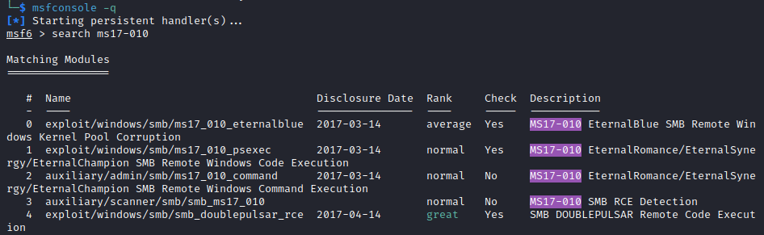
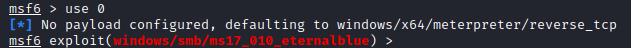
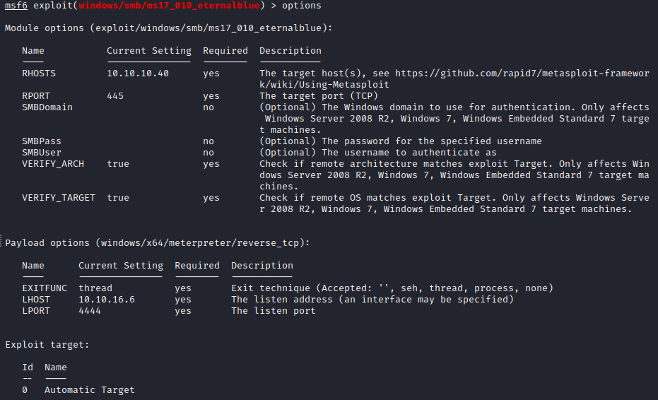
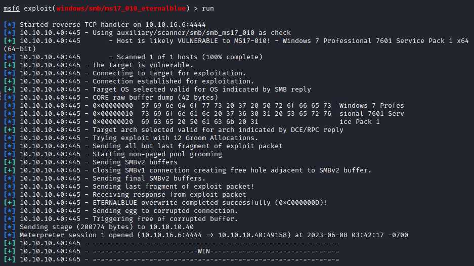
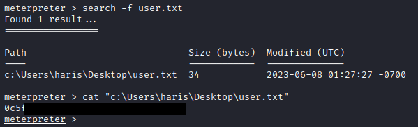
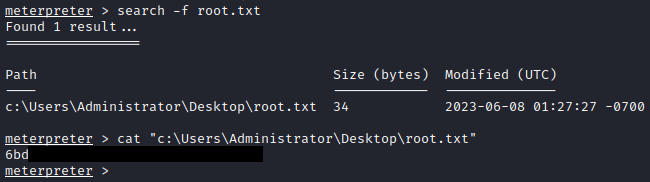

# Blue

## Overview

Blue is an easy [HackTheBox machine](https://app.hackthebox.com/machines/Blue) that is created by [ch4p](https://app.hackthebox.com/users/1) in 29 July 2017. It is also a retired machine, so we will need to use the HackTheBox Subscription to use the machine.

## Enumeration

First, we need to get what services that were running in the Blue machine. To scan the services, we can use [Nmap](https://nmap.org/) or [Threader3000](https://github.com/dievus/threader3000).

To get the first initial port scan, I will be using nmap.

After getting the opened ports, we can now try to scan their vulnerabilities using Nmap.

Based on the vulnerabilities. The machine seems to be vulnerable to ms17-010 or also known as **EternalBlue**.

> EternalBlue is an exploit that allows cyber threat actors to remotely execute arbitrary code and gain access to a network by sending specially crafted packets of Server Message Block (SMB) protocol.

## Exploit

To gain access to the machine, we can use [Metasploit](https://www.metasploit.com/). Let's run the metasploit by typing `msfconsole` or `msfconsole -q` to disable the banner print. Then type `search ms17-010`.

We can see that there are 3 Metasploit modules that can be use to exploit EternalBlue (which is started with `exploit/`). In this case, we will try to use the `exploit/windows/smb/ms17_010_eternalblue` by typing `use 0` or `use exploit/windows/smb/ms17_010_eternalblue`

Now lets configure the settings. For instance, we set the rhost to the target and the lhost to the IP of our HTB VPN.

All set! All that we need to do is to run the module by typing `exploit` or `run`.

> As we can see, there is a banner on the bottom that said **WIN**. That means, we are able to exploit, gain access to the machine, and getting a meterpreter session.

Lastly, we need to find the flag. We know that the format of the flags are `user.txt` and `root.txt`. So we can utilize meterpreter's search command.

> Note: the `-f` in search command is to specify that we were looking for a file.

Andddd we were able to read the root flag.

