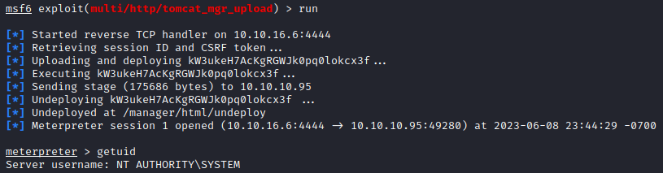

# Jerry

## Overview

Jerry is an easy [HackTheBox machine](https://app.hackthebox.com/machines/Jerry) that is created by [mrh4sh](https://app.hackthebox.com/users/2570) in 1 July 2018. It is also a retired machine, so we will need to use the HackTheBox Subscription to use the machine.

## Enumeration

Let's scan the machine to get a hold of which port and service is running.

It seems that the machine has only one service running on port 8080.

As usual, let's check the vulnerabilities within the service.

The service turns out to be `http` with version `Apache Tomcat/Coyote JSP engine 1.1`. Since the service is http, we should check the web page.

On the web page, there is `Manager App` menu which will prompt login menu.

## Exploit

On the internet, there is an article that writes about the Metasploit modules that can be used to Apache Tomcat. If you are interested in reading it, here is the [article](https://charlesreid1.com/wiki/Metasploitable/Apache/Tomcat_and_Coyote#Metasploit_Modules_for_Tomcat).

To try brute-forcing the login prompt, we can try to utilize module in Metasploit. In Metasploit, there is a brute force login to apache tomcat called `auxiliary/scanner/http/tomcat_mgr_login`.

We can try to set or configure the module so it match the machine.

> Note: The image above is my configuration. I set `STOP_ON_SUCCESS` to `True` so when the credentials already found, the process will be stopped.

Run the module.

Using the credential found, we can try to login to the previous login prompt.

After successfully login as `tomcat` and observing the website for a while. On the bottom of the http://10.10.10.95:8080/manager/html page, there is the OS Name. It shows that the server is Windows machine. That way we can use windows payload.

To gain access to the shell. We can use the `exploit/multi/http/tomcat_mgr_upload` module on Metasploit. Here is my configuration to be able to gain access.

And let's run it.

All that is left to do is to retrieve the flags. As usual, the flags in Windows machine usually saved/stored in `C:\Users\User\Desktop` and `C:\Users\Administrator\Desktop`.

After looking for a while, turns out the flag is saved on the `C:\Users\Administrator\Desktop` inside the folder `flags`.

Just read the file using `cat` and we are good to go!

