# Lame

## Overview

Lame is an easy [HackTheBox machine](https://app.hackthebox.com/machines/Lame) that is created by [ch4p](https://app.hackthebox.com/users/1) in 15 Mar 2017. It is also a retired machine, so we will need to use the HackTheBox Subscription to use the machine.

## Enumeration

Enumeration is key! We need to know which ports and services are running in the machine.

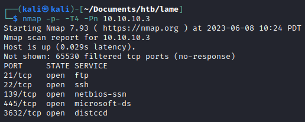

Okay, there are ftp, ssh, smb, and distccd running. Now lets scan the vulnerability within the services.

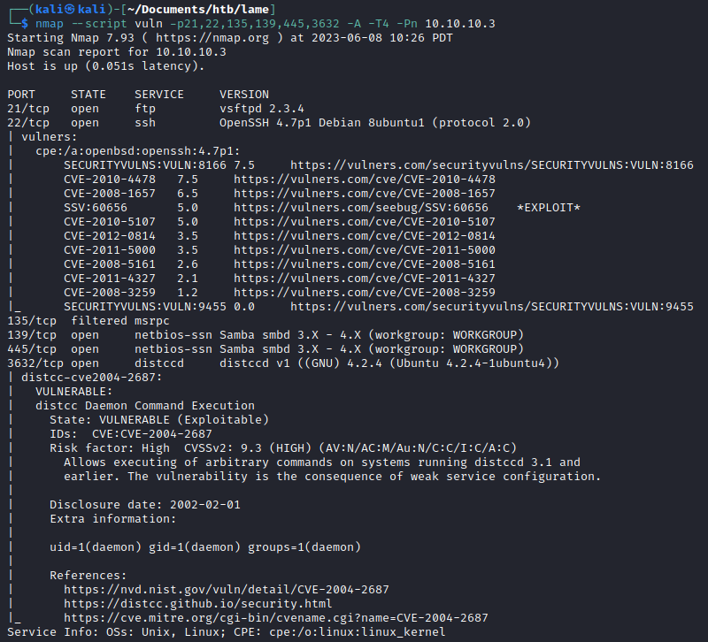

## Exploit

From the result of the vuln scan, the distccd service is vulnerable to CVE-2004-2687. The vulnerability allow us to do command execution. With that vulnerability in mind, we can try to search the vulnerability in metasploit.

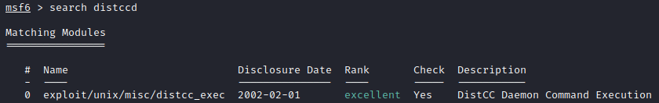

Found it!. Now lets configure it so it suits the machine.

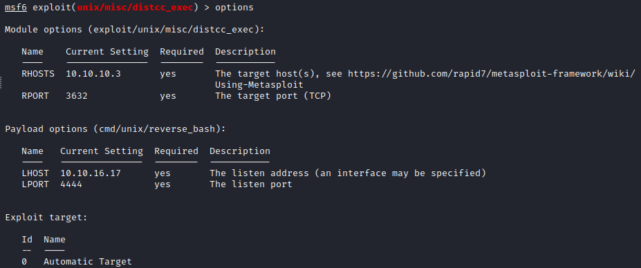

And run it

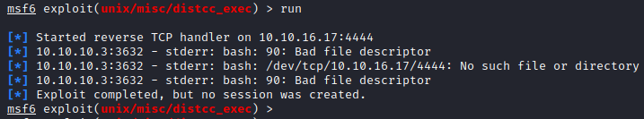

It says that the exploit is completed but no session was created. We can try one more thing, that is to change the payload. 

Lets check the payloads that is available.

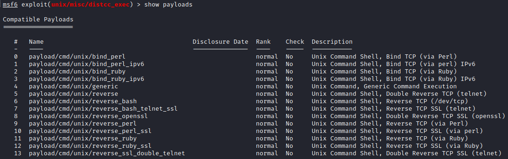

On number 5, there is a simple payload called `payload/cmd/unix/reverse`. Lets try that.

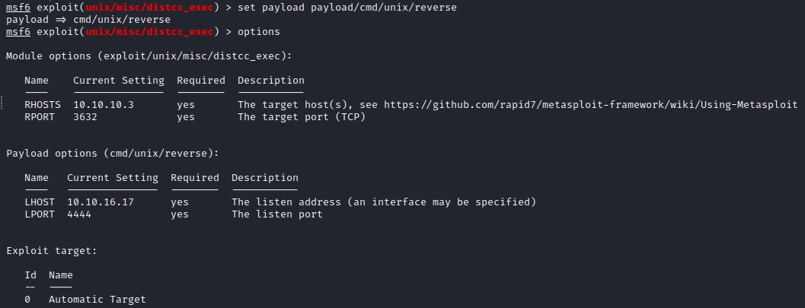

Now we can try to run the module again.

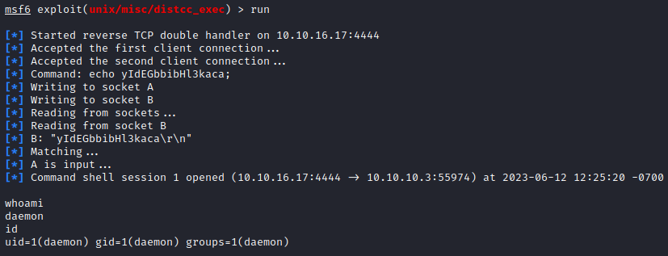

We got a reverse shell! We can try to upgrade the reverse shell session to meterpreter session by background the current session (either by using `ctrl+z` or type `background`) then type `sessions -u <shell session>`.

Since the shell session is in session 1. We will type `sessions -u 1`.

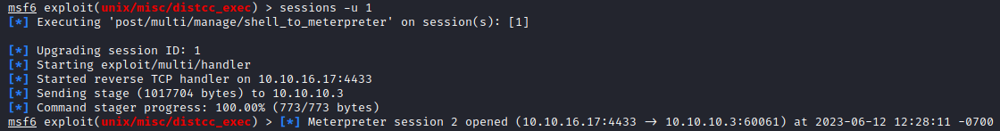

The meterpreter sessions should be in session number 2. Lets try to check it if the assumption is right.

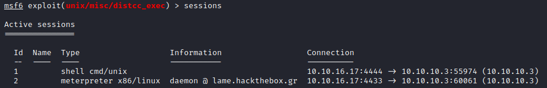

Good! Now we can go to our meterpreter session by typing `sessions 2` and we can try to retrieve the flags.

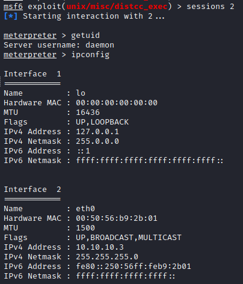

Search the user flags by using `search -f <filename>` in meterpreter session and read it using `cat <filename>`.

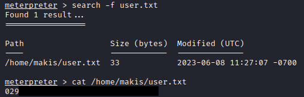

Now lets try to find and read the root file.

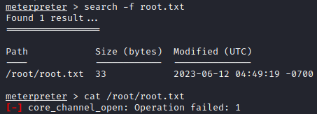

It seems like the privilege issue. We need to elevate our privilege to root to read the root flag. The very first command that I usually try to do **privilege escalation** is `uname -a` to check the Linux version. There is a possibility that the Linux version is outdated and has a privilege escalation exploit on the internet.

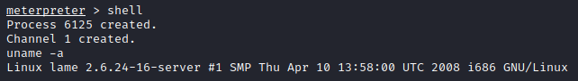

> Note: Since we have the meterpreter session. We can run the command in shell. So we could type `shell` first to get to the shell session. If we need to go back to our meterpreter session, we can simply `background` the shell by using `ctrl+z` or type `background`.

As we can see, the machine is `Linux lame 2.6.24-16-server`. I would like to highlight the **`2.6.24-16-server`** part since it indicates the current version of the machine.

Now lets try to search the exploit on the internet.

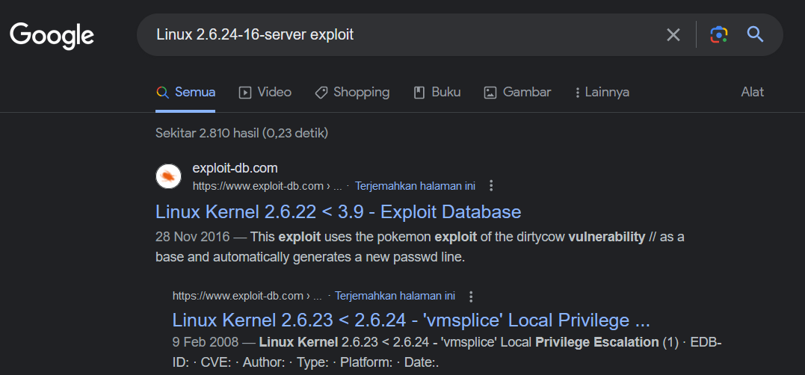

We could always try from the top of the page. Lets check the [exploit-db](https://www.exploit-db.com/exploits/40839) page.

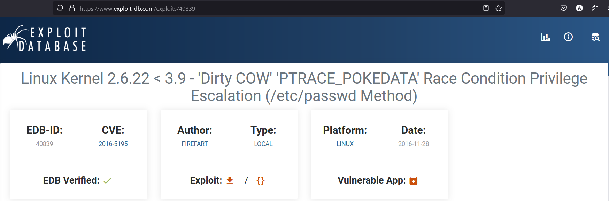

From the title, we can verify that the lame machine is vulnerable to this exploit. The machine current version is **`2.6.24`** and the exploit vulnerability is from version **`2.6.22`** to **`3.9`**.

Lets scroll it down a little bit to see how the exploit works and how to use it.

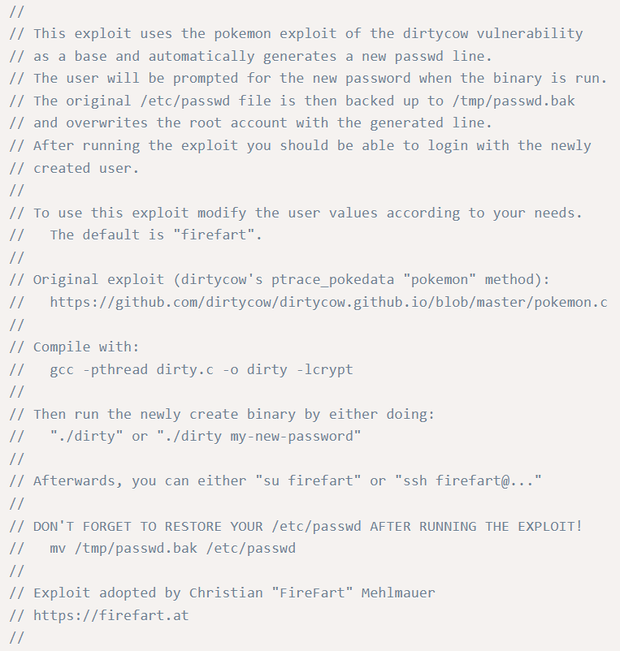

Okay, if we break it down a little bit. We can see that the exploit will copy the `/etc/passwd` which keeps track of every registered user that has access to a system and replace the root user to `firefart` which is the default user on the exploit.

To run it, first we need to upload the exploit to the machine. Compile it with `gcc -pthread <filename>.c -o <filename> -lcrypt`. Then run it `./<filename>` or `./<filename> <new password>`.

After that we can try to change user to `firefart` or utilize the ssh service to log in.

Now lets download the file to our local machine. We can copy the url.

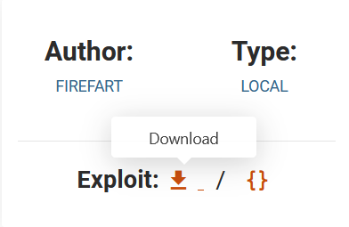

Then use `wget` to download the file.

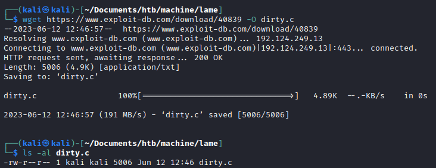

> Note: the `-O` in wget is to rename the output file that downloaded.

Now lets go back to our shell within our meterpreter session. To make it easier to see, wether the command is done running. We can enable the tty. The easiest one is if the machine has python. Now lets check if the machine has python or not by using command `which`.

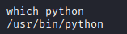

Great! The machine has python. We can then use the python to spawn a tty shell. To spawn the tty shell, we can use the following command `python -c 'import pty; pty.spawn("/bin/sh")'`.

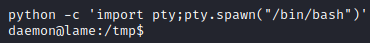

> Note: The **`python`** part on the command can be modified to match to whichever python version is available on the machine. For instance, if the machine has `python3` (we can check it by typing `which python3`). The command could be modified to `python3 -c 'import pty; pty.spawn("/bin/sh")'`.

Now we need to upload the exploit file to the machine. Lets go back to our meterpreter session. Then use command `upload <filename / path to file>` to upload the file. But before we upload the file, we need to make sure that we should change the directory to `/tmp`.

> The reason is that the /tmp file is usually get cleaned up after each reboot. If you want to know more about `/tmp` directory, you can read this [article](https://linuxhandbook.com/tmp-directory/).

Done reading? Now lets try to upload the exploit.

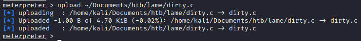

Lets go back to our shell session by typing `channel -i <channel id>`. To check which channel is active, we can use command `channel -l`.

It's time to escalate our privilege to root. Remember the commands that we need before we run the exploit? Good! First, we need to compile the exploit first.

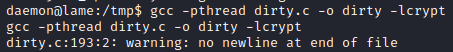

Second, run the exploit (we could specify the password too if you want). In this case, I use `secret-password` to be the firefart's password.

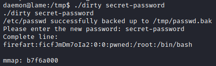

> Note: Remember, that the root will be overwrite to firefart. So firefart is actually root.

We successfully run the exploit. Now what? We can try to change the user by typing `su firefart`. But it doesn't work. We can try to spawn another shell, then change the user. But it doesn't work either.

Remember there are two ways to gain access as firefart? Yes! The ssh method. Since the ssh on the machine is running, we can utilize it to gain access as firefart.

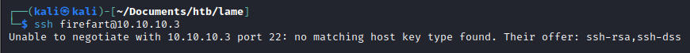

Whoops, the machine only using ssh-rsa and ssh-dss. Add these few command (`-oHostKeyAlgorithms=+ssh-dss`), and we're good to go (source: https://askubuntu.com/questions/836048/ssh-returns-no-matching-host-key-type-found-their-offer-ssh-dss).

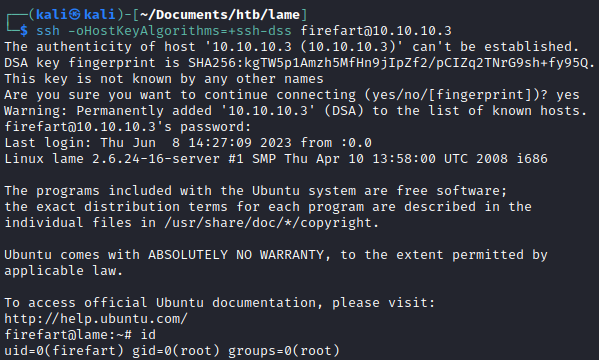

Good work! We finally gain access as firefart which has root privilege. Now lets read the root flag which is located in ~ directory.

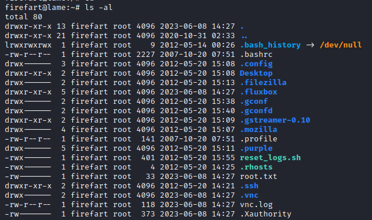

Root flag

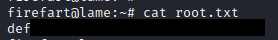