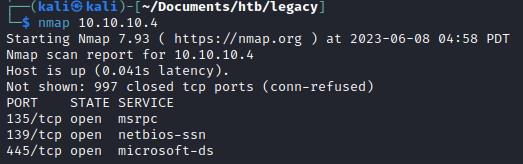
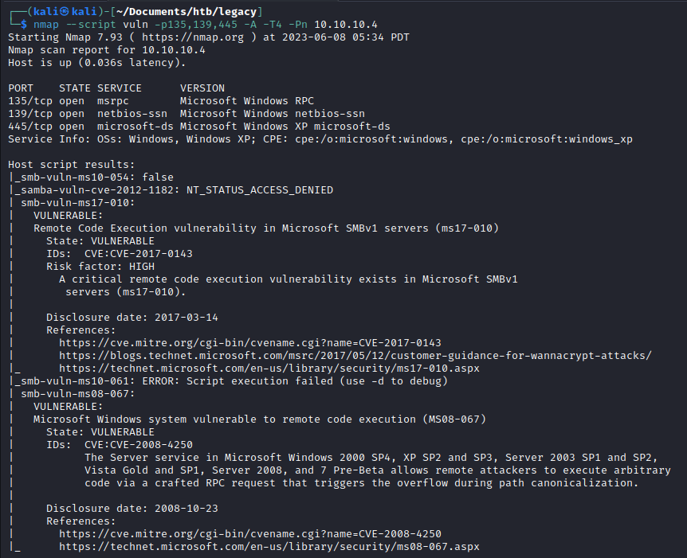
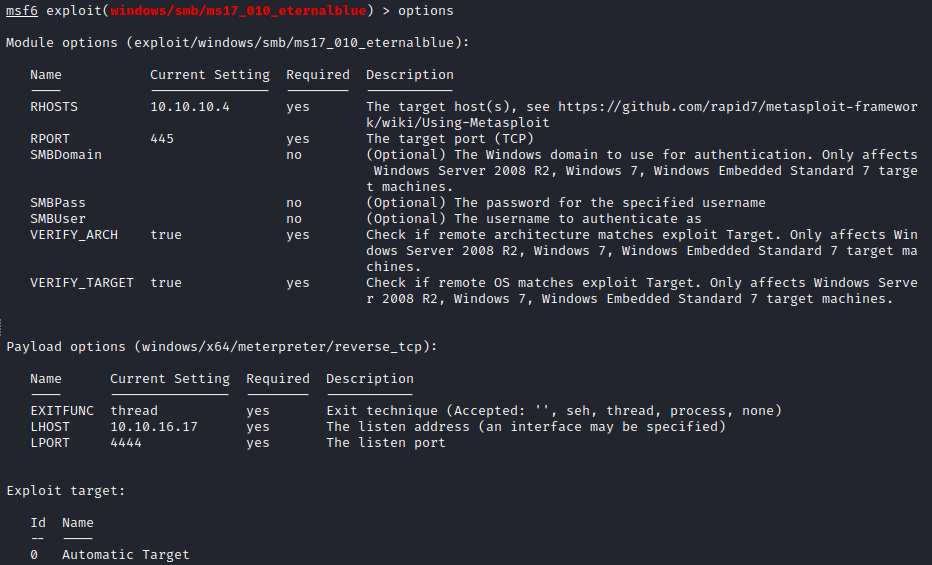
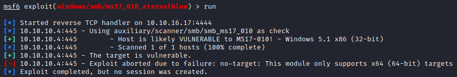
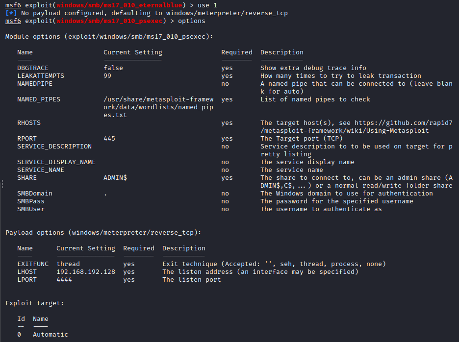
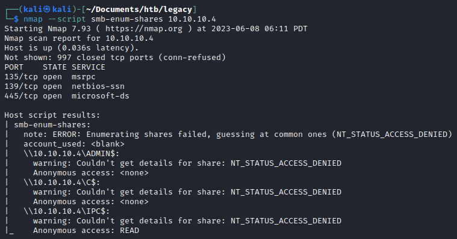
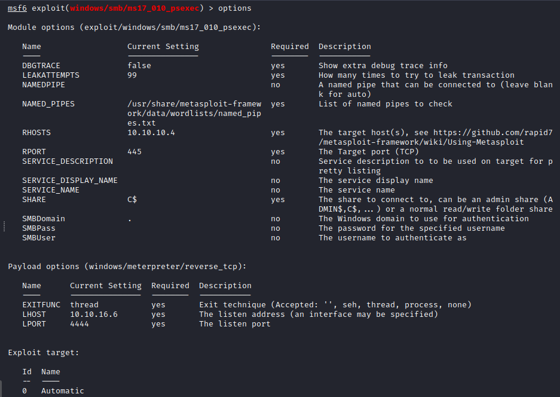
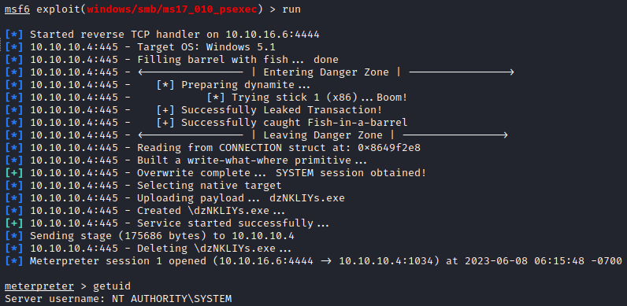
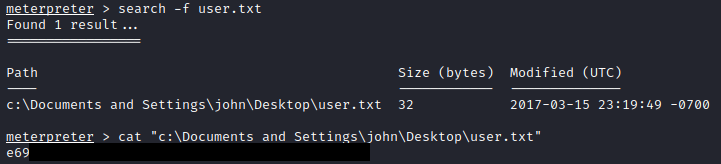
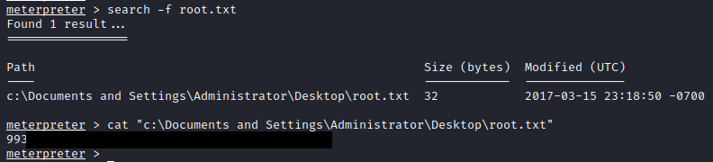

# Legacy

## Overview

Legacy is an easy [HackTheBox machine](https://app.hackthebox.com/machines/Legacy) that is created by [ch4p](https://app.hackthebox.com/users/1) in 15 Mar 2017. It is also a retired machine, so we will need to use the HackTheBox Subscription to use the machine.

## Enumeration

As usual, we need to know which ports and services are running on the machine.

After getting the ports and services, we could try to enumerate the vulnerabilities.

Got it! SMB is running on the machine and it is vulnerable to ms17-010 or EternalBlue. Time to take out our Metasploit!

## Exploit

This time lets use the same module with the [Blue Machine](https://github.com/ArjunaAcchaDipa/HackTheBox/tree/main/Machines/Blue) and set it so it match to the machine.

Lets run it.

Okay.. It doesn't work. Lets use the other module.

There are **share** option that can be specified. Lets try to enumerate the SMB shares first.

Since we know the shares, we can try each of the shares to the module.

In this machine, the `C$`'s share is the one that can be use to exploit.

After set the options, now we can run the module.

Since we are getting the `NT AUTHORITY\SYSTEM` privilege which is the highest privilege in Windows machine. We can now utilize `search` command in meterpreter session to search and read the flags.

User flag

Root flag

