# Netmon

## Overview

Netmon is an easy [HackTheBox machine](https://app.hackthebox.com/machines/Jerry) that is created by [mrb3n](https://app.hackthebox.com/users/2984) in 3 March 2019. It is also a retired machine, so we will need to use the HackTheBox Subscription to use the machine.

## Enumeration

Using Nmap, we can determine which ports and services is running on the machine.

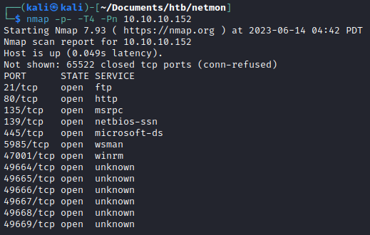

Based on the port and services running, the one that caught my eyes were 21 - [FTP (File Transfer Protocol)](https://www.hostinger.com/tutorials/what-is-ftp), 80 - HTTP, and 135 - 139 - 445 - SMB. Since the three of them usually the entry point of the exploitation.

To get more information about the ports and services, I will use Nmap with `vuln` script to scan the vulnerabilities within the ports and services.

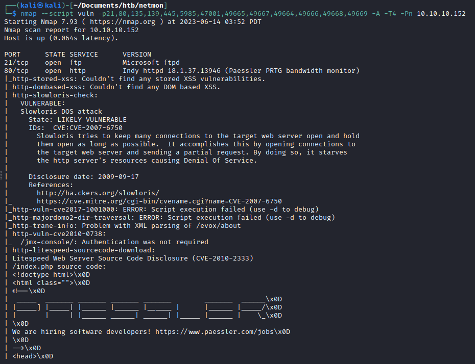

Since ftp doesn't get any output from the vulnerability check. We can check some of the exploit manually. For instance, we can try to log into ftp as anonymous (user and password is `anonymous`).

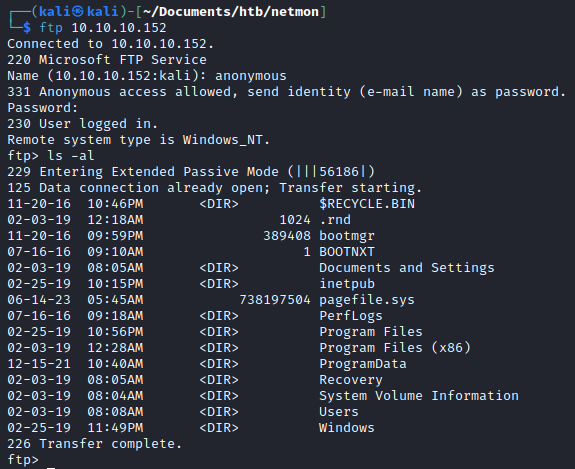

> Turns out, anonymous login is allowed.

Now since we have the access to FTP. We can try to retrieve the flags.

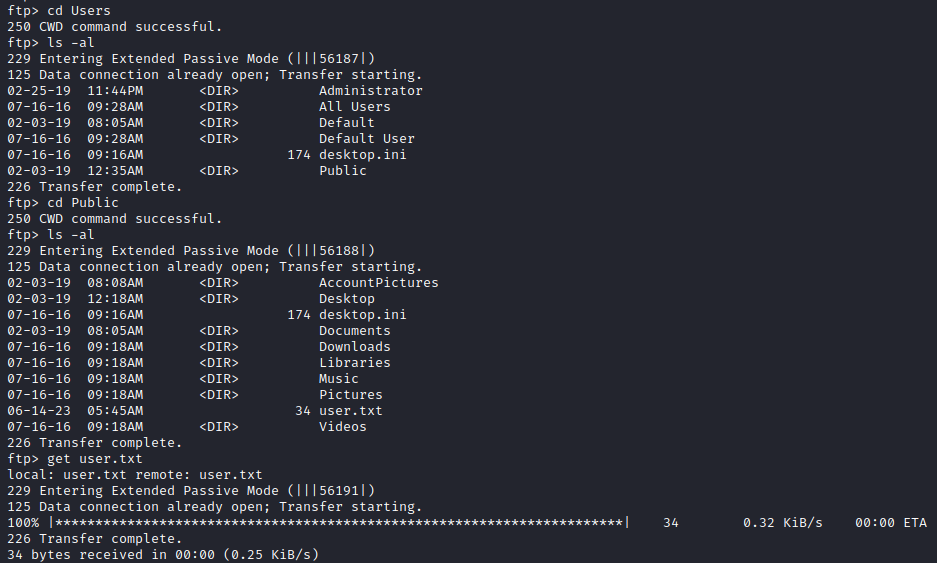

Then read the flag on local machine.

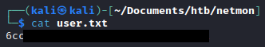

Other than user flag, the root flag cannot be accessed through FTP. Let's try another way!

Since the machine has PRTG HTTP Web Page, we can try to see what is inside of the website.

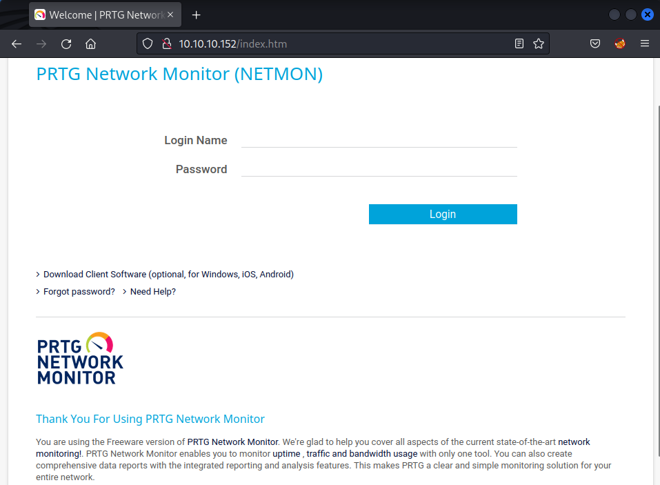

We should try default login credentials to PRTG, which is `prtgadmin:prtgadmin`.

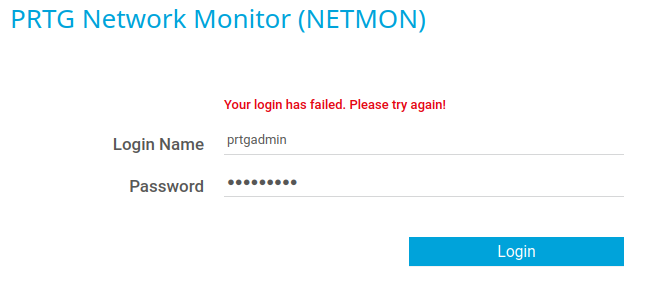

Turns out, that the default credentials doesn't works.

Lets try another way by searching more the data saved on FTP. Based on this article https://kb.paessler.com/en/topic/463-how-and-where-does-prtg-store-its-data, the PRTG data is saved in program directory, data directory, or registry.

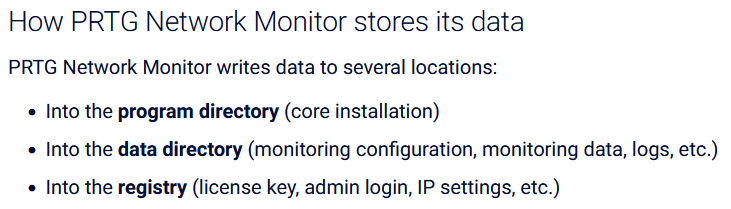

With the knowledge of where the data might be saved, we can try to search it in FTP.

After searching it for a while, I found that the file is saved in `Users/All Users/Paessler/PRTG Network Monitor`.

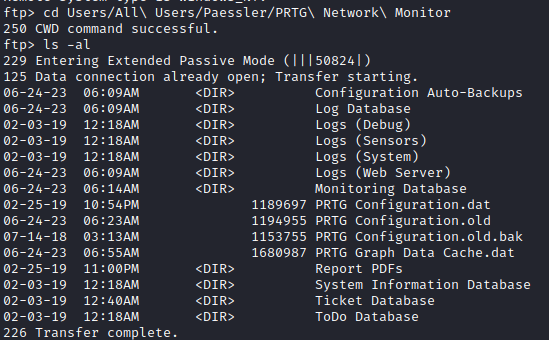

From the listing files. There is `PRTG Configuration.old.bak` which is an old backup file. It might have a credential inside. So let's download it.

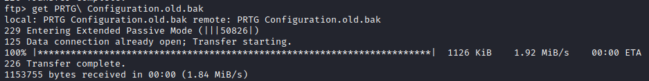

We can open it in any of the file editor. In this case I will be using Sublime. After open the file in Sublime, we can try to search for `password`.

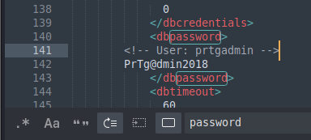

There is credential found in PRTG Configuration.old.bak. It seems the credential is `prtgadmin:PrTg@dmin2018`.

Since we already have the credential. Now we can utilize the Metasploit `exploit/windows/http/prtg_authenticated_rce` module.

Let's configure the module for a while.

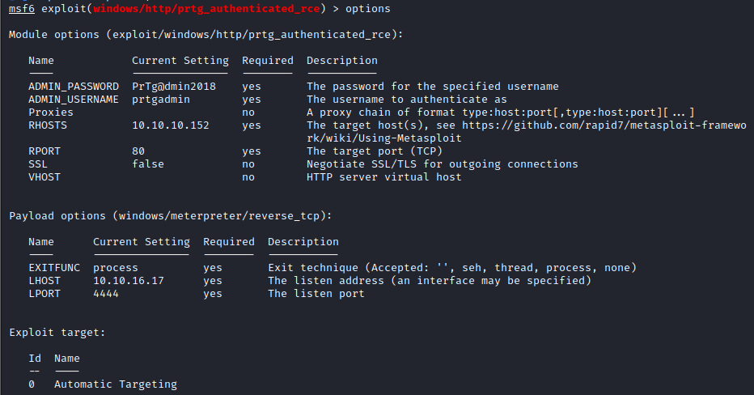

And run it.

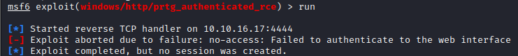

Turns out the module failed to authenticate. That means the credentials is wrong.

After trying other things for a while, I realize that the password has years on it. Then I tried to brute force it, and change the year from 2018 to 2019.

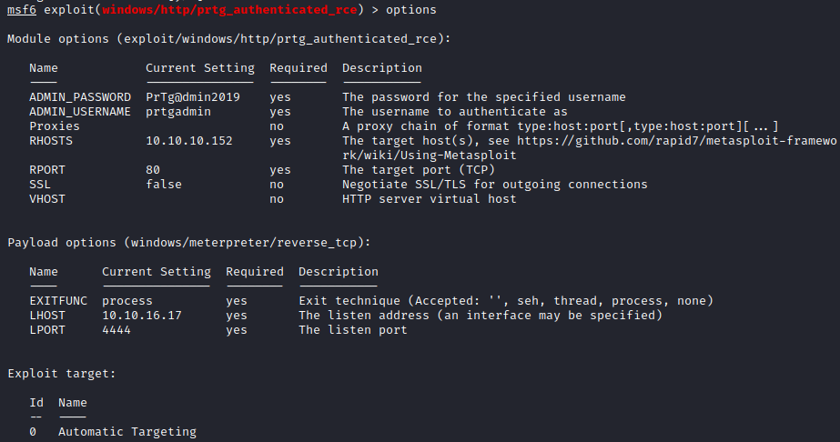

And tried to run it again.

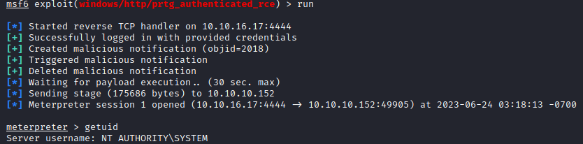

BINGO! I finally gain the access and getting a meterpreter session.

Now we can try to search and read the root flag.

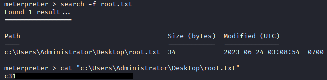